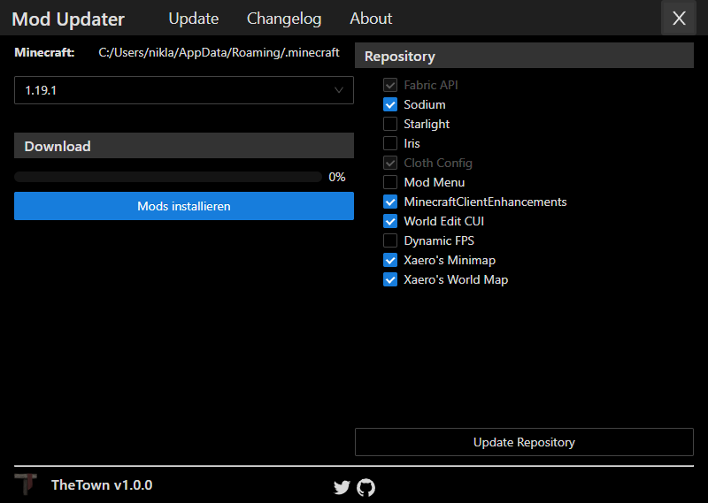

# Minecraft Mod Updater

The Mod Updater allows users to easily update mods.


### Configure
If you want to use our launcher for your project, **please change the icons**! Please comply with the project license.
Open ``frontend/src/staticContent/index.js`` and edit the variables as you need.
To configure your logo replace the _logo\*_ and _*.ico_ files.

### Live Development

To run in live development mode, run `wails dev -frontenddevserverurl http://localhost:3000 -s` in the project directory. Run `npm start` in the `frontend/` folder to skip recompiling the whole frontend on any change. Wails will watch and re-build the app for every backend (golang) changes.

### Build
To build this project you need [Wails2](https://wails.io). Check your setup with `wails doctor`.  
To compile the project run
```bash
wails build
```

Alternatively look at the ``.github/workflows/main.yml`` for an example pipeline run.

### Distribute
After building the package you find inside the ``build/bin/`` folder the executable.

### Server side setup
For the server side you need a simple webserver with [CORS](https://serverfault.com/a/844963) enabled.

You can find the minimal server configs in the ``server/`` folder.

#### versions.json
This json file lists all currently supported Minecraft version that users can select from the Mod Updater.
If you're adding a new `version/<version>.json`, don't forget to add it to this file either.

This file also contains the current Mod Updater version which is checked against the current version for update notifications.

#### versions/*.json
This directory contains a collections of Mods. Every collection is stored in a `<version>.json` file.
To inform the Mod Update about the existence of a collection, you also have to add the version to the `../versions.json` file.

#### changelog.md
The *changelog.md* is a markdown file to write your changelogs for the modpacks, client or what ever.  
The file is cached clientside and only loaded if the user switches the tab to the changelog tab.

## Screenshots
  

